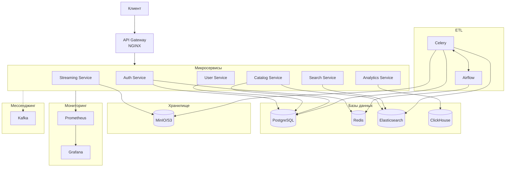

# OnlineCinema

Микросервисная платформа для онлайн-кинотеатра.

## Технологический стек

- **Основной язык:** Python
- **Фреймворки:** FastAPI (основные сервисы)
- **Базы данных:**
  - PostgreSQL (основные данные)
  - Redis (кэширование, сессии)
  - ClickHouse (аналитика)
  - Elasticsearch (поиск)
- **Proxy:** NGINX
- **Хранилище:** MinIO/S3 (для видеофайлов)
- **Очереди сообщений:** Kafka
- **Контейнеризация:** Docker, Docker Compose
- **Мониторинг:** Prometheus, Grafana, OpenTelemetry, Grafana Tempo
## Технологический стек


## Быстрый старт

### Требования

- Docker и Docker Compose
- Git

### Установка и запуск

1. **Клонируйте репозиторий:**
   ```bash
   git clone <repository-url>
   cd OnlineCinema
   ```

2. **Создайте файл окружения:**
   ```bash
   cp infrastructure/.env.example infrastructure/.env
   ```

3. **Запустите проект:**

   Минимальный набор (PostgreSQL + Redis):
   ```bash
   cd infrastructure/docker
   docker compose --profile core up -d
   ```

   Полный стек:
   ```bash
   docker compose --profile full up -d
   ```

### Профили Docker Compose

| Профиль | Сервисы |
|---------|---------|
| `core` | PostgreSQL, Redis |
| `messaging` | Kafka, Zookeeper |
| `search` | Elasticsearch |
| `analytics` | ClickHouse |
| `storage` | MinIO |
| `monitoring` | Prometheus, Grafana, Tempo, Jaeger, OpenTelemetry Collector |
| `services` | Все микросервисы |
| `gateway` | NGINX |
| `full` | Все сервисы |

Пример запуска нескольких профилей:
```bash
docker compose --profile core --profile messaging --profile services up -d
```

### Порты сервисов

| Сервис | Порт |
|--------|------|
| Auth Service | 8001 |
| User Service | 8002 |
| Catalog Service | 8003 |
| Search Service | 8004 |
| Streaming Service | 8005 |
| Analytics Service | 8006 |
| NGINX | 80/443 |
| Grafana | 3000 |
| Prometheus | 9090 |
| Tempo | 3200 |
| Jaeger UI | 16686 |
| MinIO Console | 9001 |
| Elasticsearch | 9200 |
| ClickHouse HTTP | 8123 |

### Остановка

```bash
docker compose --profile full down
```

Для удаления volumes:
```bash
docker compose --profile full down -v
```
